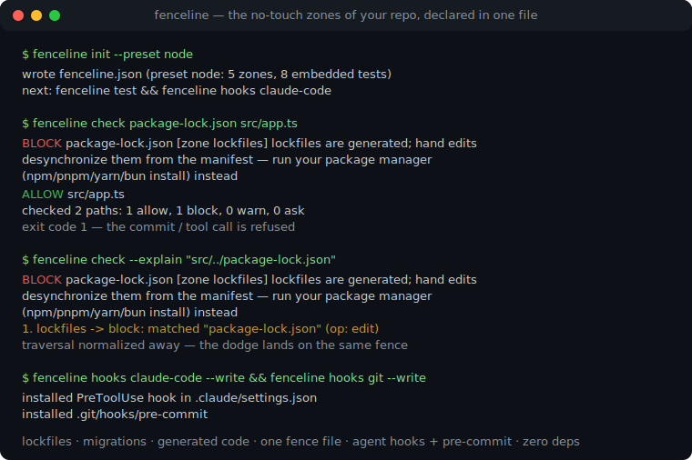
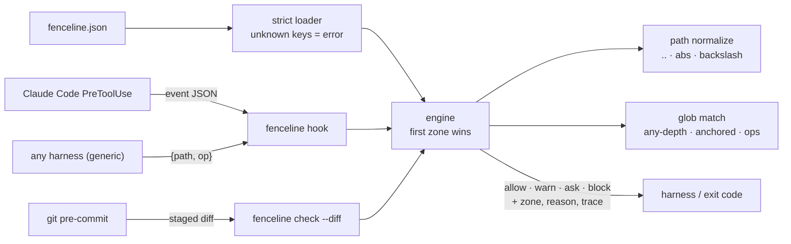

# fenceline

[English](README.md) | [中文](README.zh.md) | [日本語](README.ja.md)

[](LICENSE)   [](CONTRIBUTING.md)

**リポジトリのための宣言的な保護パスルール：レビューできる 1 枚のフェンスファイルに立入禁止ゾーン（lockfile、マイグレーション、生成コード）を明記し、agent hook とスタンドアロンのチェッカーで強制する。ランタイム依存ゼロ、完全オフライン。**



```bash
# not yet on npm — install from a checkout of this repository
npm install && npm run build && npm pack
npm install -g ./fenceline-0.1.0.tgz
```

## なぜ fenceline？

エージェントにリポジトリを触らせたチームは必ず一度同じ教訓を得る：モデルが `package-lock.json` を手編集し、適用済みの DB マイグレーションを「修正」し、次のビルドで消える生成コードにパッチを当てる——どれも局所的にはもっともらしく、どれも後始末は厄介だ。どのパスが不可侵かという知識は存在するのに、口伝とレビューコメントの中にしかなく、ツールが強制できる場所にない。よく使われる各レイヤーが解くのは隣の問題である：agentcage のような OS サンドボックスは*プロセス*が触れる範囲を制限するが、マウント単位のルールでは「このファイルは生成物だから作り直せ」とは言えない——しかもエージェントはツリーの大半に正当な書込権限を必要とする。CODEOWNERS やブランチ保護が発火するのはレビュー時で、被害はすでに diff の中にある。agent hook に括り付けられる番人スクリプトは、誰もテストしないレビュー不能な使い捨て正規表現だ。fenceline はその欠けていた成果物である：理由と対処ヒント付きで立入禁止ゾーンを宣言する 1 枚の JSON フェンスファイルを、ハーネスの hook（Claude Code PreToolUse、git pre-commit、汎用 stdin/stdout プロトコル）へコンパイルし、任意のパスリストや diff に対して単体でも検査できる。ゾーンは*操作*を区別し——追記専用の `migrations/` は編集を止めて新規作成を通す——判定はゾーンごとにトレースされ、フェンス自身が埋め込みテストを持つため、ルールの並べ替えで壊れるのはビルドであってリポジトリではない。

|  | fenceline | OS サンドボックス（agentcage、Landlock） | CODEOWNERS / ブランチ保護 | 手書き hook スクリプト |
|---|---|---|---|---|
| レイヤー | ファイル編集の意図、実行前 | OS システムコール、実行中 | サーバー側、レビュー時 | 場当たり、実行前 |
| 粒度 | パスパターン + 操作（edit/create/delete/rename） | マウント/inode ルール | PR 単位のパスパターン | 書いた人次第 |
| *なぜ*と*代わりに何を*を言えるか | 言える——ゾーンごとに reason + hint | 言えない | レビューコメント頼み | まれ |
| 追記専用ディレクトリ（create を通し edit を止める） | 対応 | 非対応 | 非対応 | 場合による |
| レビューできる成果物 | 宣言的な JSON ファイル 1 枚 | ルールセット設定コード | CODEOWNERS ファイル | 命令的なコード |
| テスト可能性 | 埋め込みポリシーテスト + ゾーン固定 | 統合テストのみ | 実 PR で試すのみ | まれ |
| オフライン動作 / 依存ゼロ | はい | はい | いいえ——サーバー機能 | 場合による |

<sub>これはレイヤー比較でありランキングではない——fenceline はファイル編集の意図を判定し、その下のシステムコールサンドボックスと相補的に働く。各主張は各方式の公開ドキュメントに照らして確認済み、2026-07。</sub>

## 特徴

- **1 枚のフェンスファイル、複数の強制ポイント** —— 同じ `fenceline.json` が Claude Code PreToolUse hook、git pre-commit、他ハーネス向けの汎用 JSON プロトコル、CI・スクリプト用のスタンドアロンチェッカーへコンパイルされる。
- **拒否だけでなく理由を持つゾーン** —— すべての判定がゾーンを名指しし、人間向けの `reason` と対処 `hint`（「npm install を使え」）を携える。エージェントは盲目的な再試行ではなくルールそのものを学ぶ。
- **操作を認識するフェンス** —— ゾーンは `edit` / `create` / `delete` / `rename` でフィルタする：適用済みマイグレーションは追記専用になり、claude-code アダプタはファイルの存在を調べて `Write` を新規か上書きかに分類する。
- **トラバーサルでは躱せない** —— すべてのパスはパターン照合の前にフェンスルートに対して字句的に正規化される（`..`、`//`、バックスラッシュ、絶対パス）。`src/../package-lock.json` は同じフェンスに当たる。
- **自己テストするフェンス** —— `tests` 配列がパスを期待判定と判定ゾーンに固定する。リファクタで結果が変われば `fenceline test` が落ち、どの `init` プリセットも最初から自身のテストに合格する。
- **3 つのアクション、3 つの終了コード** —— `block`（1）、`ask`（3）、`warn`（0 + 通知）：shell hook は終了コードだけで門番になれ、危険だが正当なパスには一律拒否ではなく人間への経路がある。
- **ランタイム依存ゼロ、完全オフライン** —— 必要なのは Node.js だけ。エンジンは裁くファイルを決して開かず、devDependency は `typescript` のみ。

## クイックスタート

インストール：

```bash
# not yet on npm — install from a checkout of this repository
npm install && npm run build && npm pack
npm install -g ./fenceline-0.1.0.tgz
```

プリセットから始めてパスを検査する（実際の実行記録）：

```bash
fenceline init --preset node
fenceline check package-lock.json src/app.ts
```

```text
wrote fenceline.json (preset node: 5 zones, 8 embedded tests)
next: fenceline test && fenceline hooks claude-code
BLOCK  package-lock.json  [zone lockfiles] lockfiles are generated; hand edits desynchronize them from the manifest — run your package manager (npm/pnpm/yarn/bun install) instead
ALLOW  src/app.ts
checked 2 paths: 1 allow, 1 block, 0 warn, 0 ask
```

終了コード 1——pre-commit や CI ステップに必要なのはこれだけ。トラバーサルも同じフェンスに当たり、`--explain` が決定打となったパターンを示す（実際の実行記録）：

```bash
fenceline check --explain "src/../package-lock.json"
```

```text
BLOCK  package-lock.json  [zone lockfiles] lockfiles are generated; hand edits desynchronize them from the manifest — run your package manager (npm/pnpm/yarn/bun install) instead
   1. lockfiles -> block: matched "package-lock.json" (op: edit)
```

次にフェンスをハーネスへコンパイルする——`fenceline hooks claude-code --write` の後、エージェントによる lockfile 編集の試みは hook プロトコルで応答される（実際の実行記録、本来は 1 行、表示上折返し）：

```text
{"hookSpecificOutput":{"hookEventName":"PreToolUse","permissionDecision":"deny",
 "permissionDecisionReason":"fenceline: \"package-lock.json\" (edit) [zone lockfiles]:
 lockfiles are generated; hand edits desynchronize them from the manifest — run your
 package manager (npm/pnpm/yarn/bun install) instead"}}
```

完全なフェンス 2 枚（追記専用マイグレーションを持つ Web アプリと OSS ライブラリ、合計 17 件の埋め込みテスト）は [examples/](examples/README.md) にある。

## フェンスファイル

JSON ファイル 1 枚：順序付きの `zones`（`block`/`ask`/`warn` アクション）、gitignore 風パターン、`except` の除外、ゾーンごとの `ops`、埋め込み `tests`。完全なリファレンスは [docs/policy-format.md](docs/policy-format.md)。

| キー | 既定値 | 効果 |
|---|---|---|
| `zones[].paths` | — | パターン：裸の名前は任意の深さで一致、`dir/` はサブツリーを覆い、`**`/`*`/`?`/`{a,b}`/`[a-z]` に対応 |
| `zones[].except` | `[]` | 除外——一致したパスは後続ゾーンへ抜ける |
| `zones[].ops` | 4 種すべて | 対象操作：`edit`、`create`、`delete`、`rename` |
| `zones[].reason` / `hint` | 自動生成 / — | すべての判定とともに提示される |
| `outside` | `"ignore"` | フェンスルートを逃れるパスの扱い：`"ignore"` か `"block"` |
| `tests` | `[]` | 固定した判定：`{name, path, op, expect, zone}`、`fenceline test` が実行 |

## fenceline CLI

| コマンド | 動作 | 終了コード |
|---|---|---|
| `check` | パスを判定（引数、`--stdin`、`--diff`）；`--explain`、`--format json` 対応 | 0 allow / 1 block / 3 ask |
| `validate` | フェンスファイルを検証、判定はしない | 0 / 1 不正 / 2 読取不能 |
| `test` | フェンスの埋め込みテストを実行 | 0 合格 / 1 失敗 |
| `list` | 各ゾーンのアクションとパターンを表示 | 0 |
| `init` | スターターフェンスを書き出す（`--preset base\|node\|python\|go\|rust`） | 0 / 1 既存 |
| `hooks <target>` | 設定の表示または `--write` で導入：`claude-code`、`git`、`generic` | 0 / 1 / 2 |
| `hook <protocol>` | stdin のイベント 1 件をライブ hook として処理 | プロトコル定義 |

すべてのコマンドは `--policy <file>`（既定 `./fenceline.json`、次に `./.fenceline.json`）と `--root <dir>`（既定：フェンスファイルのあるディレクトリ）を取る。ハーネスごとの強制の詳細——`Write` の新規/編集分類や fail-open/`--fail-closed` の取り決めを含む——は [docs/harness-hooks.md](docs/harness-hooks.md) にある。

## fenceline でないもの

OS サンドボックスではない。fenceline は*提案された*変更を字句的に判定する——shell コマンドが同じファイルへ書くのは止められないので、プロセスレベルの壁は引き続きその下の agentcage・コンテナ・Landlock に任せること。git pre-commit hook はハーネスをすり抜けたものを受け止める最後の砦だ。承認システムでもない：`ask` はハーネスが備える人間側の仕組みへ判断を委ねるだけである。

## アーキテクチャ



## ロードマップ

- [x] フェンスエンジン（順序付きゾーン、block/ask/warn、ops フィルタ、except 除外）、gitignore 風 glob、字句的パス正規化、埋め込みポリシーテスト、diff の操作分類、claude-code + generic ライブ hook、git pre-commit + settings インストーラ、5 プリセット、`check`/`validate`/`test`/`list`/`init`/`hooks`/`hook` CLI（v0.1.0）
- [ ] 各ハーネスの hook プロトコルの安定に合わせたアダプタ追加
- [ ] `fenceline lint`：影に隠れたゾーン、到達不能な except、重複パターン
- [ ] コンテンツハッシュゾーン：パスだけでなくファイルの正確なバイト列を凍結
- [ ] JSON に加えて YAML フェンス入力

完全なリストは [open issues](https://github.com/JaydenCJ/fenceline/issues) を参照。

## コントリビュート

コントリビュート歓迎。`npm install && npm run build` でビルドし、`npm test` と `bash scripts/smoke.sh`（`SMOKE OK` を表示すること）を実行する——このリポジトリは CI を持たず、上記の主張はすべてローカル実行で検証されている。[CONTRIBUTING.md](CONTRIBUTING.md) を読み、[good first issue](https://github.com/JaydenCJ/fenceline/issues?q=is%3Aissue+is%3Aopen+label%3A%22good+first+issue%22) を掴むか、[discussion](https://github.com/JaydenCJ/fenceline/discussions) を始めてほしい。

## ライセンス

[MIT](LICENSE)
