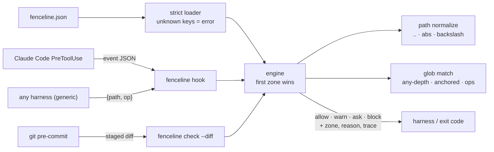

# fenceline

[English](README.md) | [中文](README.zh.md) | [日本語](README.ja.md)

[](LICENSE)   [](CONTRIBUTING.md)

**Declarative protected-path rules for repositories: one reviewable fence file naming the no-touch zones (lockfiles, migrations, generated code), enforced as agent hooks and a standalone checker. Zero runtime dependencies, fully offline.**


```bash
# not yet on npm — install from a checkout of this repository
npm install && npm run build && npm pack
npm install -g ./fenceline-0.1.0.tgz
```

## Why fenceline?

Every team that lets an agent loose on a repo learns the same lesson once: the model edits `package-lock.json` by hand, "fixes" an applied database migration, or patches generated code that the next build erases — each edit locally plausible, each one a mess to unwind. The knowledge of which paths are off-limits exists, but it lives in tribal memory and review comments, not anywhere a tool can enforce. The layers people reach for solve adjacent problems: OS sandboxes like agentcage confine what a *process* may touch, but mount-level rules cannot say "this file is generated, regenerate it instead" — and agents legitimately need write access to most of the tree; CODEOWNERS and branch protection fire at review time, after the damage is already in the diff; and the guard scripts people bolt onto agent hooks are unreviewable one-off regexes nobody tests. fenceline is the missing artifact: one JSON fence file declaring the no-touch zones with reasons and remediation hints, compiled into your harness's hooks (Claude Code PreToolUse, a git pre-commit, or a generic stdin/stdout protocol) and checkable standalone against any path list or diff. Zones distinguish *operations* — an append-only `migrations/` blocks edits while new migrations pass — decisions are traced zone by zone, and the fence carries its own embedded tests so a reordered rule fails your build, not your repository.

|  | fenceline | OS sandbox (agentcage, Landlock) | CODEOWNERS / branch protection | hand-rolled hook script |
|---|---|---|---|---|
| Layer | file-edit intent, pre-execution | OS syscalls, during execution | server-side, at review time | ad-hoc, pre-execution |
| Granularity | path patterns + operation (edit/create/delete/rename) | mount/inode rules | path patterns per PR | whatever you hand-coded |
| Can say *why* and *what to do instead* | yes — reason + hint per zone | no | via review comments | rarely |
| Append-only directories (allow create, block edit) | yes | no | no | maybe |
| Reviewable artifact | one declarative JSON file | ruleset setup code | CODEOWNERS file | imperative code |
| Testable | embedded policy tests + zone pinning | integration tests only | live PRs only | rarely |
| Works offline / zero deps | yes | yes | no — server feature | depends |

<sub>Layer comparison, not a ranking — fenceline judges file-edit intent and pairs well with a syscall sandbox beneath it. Claims checked against each approach's public documentation, 2026-07.</sub>

## Features

- **One fence file, many enforcement points** — the same `fenceline.json` compiles to a Claude Code PreToolUse hook, a git pre-commit, a generic JSON protocol for any other harness, and a standalone checker for CI and scripts.
- **Zones with reasons, not just denials** — every decision names its zone and carries the human `reason` and remediation `hint` ("run npm install instead"), so the agent learns the rule instead of retrying blind.
- **Operation-aware fencing** — zones filter on `edit` / `create` / `delete` / `rename`: applied migrations become append-only, and the claude-code adapter even classifies `Write` as create-vs-overwrite by probing existence.
- **Traversal cannot dodge** — every path is normalized lexically (`..`, `//`, backslashes, absolute forms) against the fenced root before any pattern runs; `src/../package-lock.json` lands on the same fence.
- **Fences that test themselves** — a `tests` array pins paths to expected decisions and deciding zones; `fenceline test` fails when a refactor changes an outcome, and every `init` preset passes its own tests out of the box.
- **Three actions, three exit codes** — `block` (1), `ask` (3), `warn` (0-with-notice): a shell hook can gate on the exit code alone, and risky-but-legitimate paths get a route to a human instead of a blanket no.
- **Zero runtime dependencies, fully offline** — Node.js is the only requirement; the engine never opens the files it rules on, and `typescript` is the sole devDependency.

## Quickstart

Install:

```bash
# not yet on npm — install from a checkout of this repository
npm install && npm run build && npm pack
npm install -g ./fenceline-0.1.0.tgz
```

Start from a preset and check some paths (real captured runs):

```bash
fenceline init --preset node
fenceline check package-lock.json src/app.ts
```

```text
wrote fenceline.json (preset node: 5 zones, 8 embedded tests)
next: fenceline test && fenceline hooks claude-code
BLOCK  package-lock.json  [zone lockfiles] lockfiles are generated; hand edits desynchronize them from the manifest — run your package manager (npm/pnpm/yarn/bun install) instead
ALLOW  src/app.ts
checked 2 paths: 1 allow, 1 block, 0 warn, 0 ask
```

Exit code 1 — a pre-commit or CI step needs nothing more. Traversal lands on the same fence, and `--explain` shows the deciding pattern (real captured run):

```bash
fenceline check --explain "src/../package-lock.json"
```

```text
BLOCK  package-lock.json  [zone lockfiles] lockfiles are generated; hand edits desynchronize them from the manifest — run your package manager (npm/pnpm/yarn/bun install) instead
   1. lockfiles -> block: matched "package-lock.json" (op: edit)
```

Then compile the fence into your harness — after `fenceline hooks claude-code --write`, an agent's attempt to edit the lockfile is answered on the hook protocol (real captured run, one line, wrapped):

```text
{"hookSpecificOutput":{"hookEventName":"PreToolUse","permissionDecision":"deny",
 "permissionDecisionReason":"fenceline: \"package-lock.json\" (edit) [zone lockfiles]:
 lockfiles are generated; hand edits desynchronize them from the manifest — run your
 package manager (npm/pnpm/yarn/bun install) instead"}}
```

Two complete fences (a web app with append-only migrations, an OSS library, 17 embedded tests between them) live in [examples/](examples/README.md).

## The fence file

One JSON file: ordered `zones` with `block`/`ask`/`warn` actions, gitignore-flavored patterns, `except` carve-outs, per-zone `ops`, and embedded `tests`. Full reference in [docs/policy-format.md](docs/policy-format.md).

| Key | Default | Effect |
|---|---|---|
| `zones[].paths` | — | patterns: bare names match at any depth, `dir/` covers subtrees, `**`/`*`/`?`/`{a,b}`/`[a-z]` |
| `zones[].except` | `[]` | carve-outs — matching paths fall through to later zones |
| `zones[].ops` | all four | operations covered: `edit`, `create`, `delete`, `rename` |
| `zones[].reason` / `hint` | generated / — | surfaced with every decision |
| `outside` | `"ignore"` | paths escaping the fenced root: `"ignore"` or `"block"` |
| `tests` | `[]` | pinned decisions: `{name, path, op, expect, zone}`, run by `fenceline test` |

## The fenceline CLI

| Command | Does | Exit codes |
|---|---|---|
| `check` | decide paths (args, `--stdin`, or `--diff`); `--explain`, `--format json` | 0 allow / 1 block / 3 ask |
| `validate` | check the fence file, deciding nothing | 0 / 1 invalid / 2 unreadable |
| `test` | run the fence's embedded tests | 0 pass / 1 fail |
| `list` | print every zone with action and patterns | 0 |
| `init` | write a starter fence (`--preset base\|node\|python\|go\|rust`) | 0 / 1 exists |
| `hooks <target>` | print or `--write` config: `claude-code`, `git`, `generic` | 0 / 1 / 2 |
| `hook <protocol>` | run as the live hook on one stdin event | protocol-defined |

All commands take `--policy <file>` (default `./fenceline.json`, then `./.fenceline.json`) and `--root <dir>` (default: the fence file's directory). Enforcement details per harness — including `Write` create-vs-edit classification and the fail-open/`--fail-closed` contract — are in [docs/harness-hooks.md](docs/harness-hooks.md).

## What fenceline is not

An OS sandbox. fenceline judges the *proposed* change lexically — it does not stop a shell command from writing the same file, so keep agentcage, containers or Landlock underneath for process-level walls; the git pre-commit hook is the backstop that catches whatever slipped past the harness. It is also not an approval system: `ask` defers to whatever human machinery the harness provides.

## Architecture



## Roadmap

- [x] Fence engine (ordered zones, block/ask/warn, ops filters, except carve-outs), gitignore-flavored globs, lexical path normalization, embedded policy tests, diff op classification, claude-code + generic live hooks, git pre-commit + settings installers, five presets, `check`/`validate`/`test`/`list`/`init`/`hooks`/`hook` CLI (v0.1.0)
- [ ] Adapters for more harness hook formats as their protocols stabilize
- [ ] `fenceline lint`: shadowed zones, unreachable excepts, overlapping patterns
- [ ] Content-hash zones: freeze a file's exact bytes, not just its path
- [ ] YAML fence input alongside JSON

See the [open issues](https://github.com/JaydenCJ/fenceline/issues) for the full list.

## Contributing

Contributions are welcome. Build with `npm install && npm run build`, then run `npm test` and `bash scripts/smoke.sh` (must print `SMOKE OK`) — this repository ships no CI, every claim above is verified by local runs. See [CONTRIBUTING.md](CONTRIBUTING.md), grab a [good first issue](https://github.com/JaydenCJ/fenceline/issues?q=is%3Aissue+is%3Aopen+label%3A%22good+first+issue%22), or start a [discussion](https://github.com/JaydenCJ/fenceline/discussions).

## License

[MIT](LICENSE)
