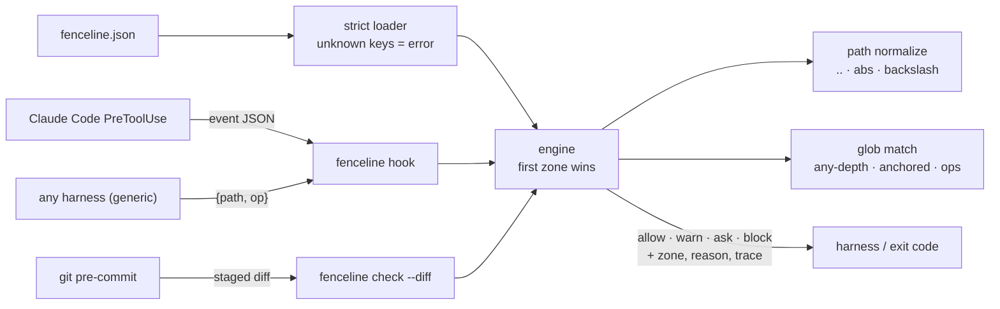

# fenceline

[English](README.md) | [中文](README.zh.md) | [日本語](README.ja.md)

[](LICENSE)   [](CONTRIBUTING.md)

**面向仓库的声明式保护路径规则：用一份可审阅的 fence 文件点名禁改区（lockfile、迁移脚本、生成代码），以 agent hook 和独立检查器双重执行。零运行时依赖，完全离线。**


```bash
# not yet on npm — install from a checkout of this repository
npm install && npm run build && npm pack
npm install -g ./fenceline-0.1.0.tgz
```

## 为什么选 fenceline？

每个放手让 agent 改仓库的团队都会吃一次同样的亏：模型徒手编辑 `package-lock.json`、"修复"一条已应用的数据库迁移、或者给下次构建就会抹掉的生成代码打补丁——每次改动局部看都合理，收拾起来却都是烂摊子。哪些路径碰不得，这份知识其实存在，但只活在口口相传和 review 评论里，没有任何工具能执行它。人们常用的几层方案解决的是相邻问题：agentcage 这类 OS 沙箱限制的是*进程*能碰什么，但挂载级规则说不出"这个文件是生成的，请重新生成"——而且 agent 对大部分目录树本来就需要写权限；CODEOWNERS 和分支保护在 review 时才触发，损害早已进了 diff；至于人们拴在 agent hook 上的守门脚本，是没人测试、无法审阅的一次性正则。fenceline 就是那个缺失的工件：一份 JSON fence 文件声明禁改区，附带理由和补救提示，编译进你的 harness hook（Claude Code PreToolUse、git pre-commit、或通用 stdin/stdout 协议），也能对任意路径列表或 diff 独立检查。zone 能区分*操作*——只许追加的 `migrations/` 拦下编辑、放行新迁移——每个判定逐 zone 留痕，fence 还自带嵌入式测试，规则被重排时挂掉的是你的构建，而不是你的仓库。

|  | fenceline | OS 沙箱（agentcage、Landlock） | CODEOWNERS / 分支保护 | 手写 hook 脚本 |
|---|---|---|---|---|
| 层次 | 文件编辑意图，执行前 | OS 系统调用，执行中 | 服务端，review 时 | 临时拼凑，执行前 |
| 粒度 | 路径模式 + 操作（edit/create/delete/rename） | 挂载/inode 规则 | 按 PR 的路径模式 | 全看你怎么写 |
| 能说明*为什么*和*该怎么做* | 能——每个 zone 带 reason + hint | 不能 | 靠 review 评论 | 很少 |
| 只许追加的目录（放行 create，拦下 edit） | 支持 | 不支持 | 不支持 | 看情况 |
| 可审阅的工件 | 一份声明式 JSON 文件 | 规则集配置代码 | CODEOWNERS 文件 | 命令式代码 |
| 可测试性 | 嵌入式策略测试 + zone 锁定 | 只有集成测试 | 只能拿真 PR 试 | 很少 |
| 离线可用 / 零依赖 | 是 | 是 | 否——服务端功能 | 看情况 |

<sub>这是分层对比而非排名——fenceline 判定文件编辑意图，与其下的系统调用沙箱正好互补。各项主张已对照各方案公开文档核对，2026-07。</sub>

## 特性

- **一份 fence 文件，多处执行点** —— 同一份 `fenceline.json` 可编译为 Claude Code PreToolUse hook、git pre-commit、面向其他 harness 的通用 JSON 协议，以及供 CI 和脚本使用的独立检查器。
- **zone 带理由，不止是拒绝** —— 每个判定都点名 zone 并携带人类可读的 `reason` 和补救 `hint`（"请改用 npm install"），agent 学到的是规则本身，而不是盲目重试。
- **感知操作的围栏** —— zone 按 `edit` / `create` / `delete` / `rename` 过滤：已应用的迁移变成只许追加，claude-code 适配器还会探测文件是否存在，把 `Write` 区分为新建或覆盖。
- **路径穿越躲不掉** —— 每个路径都先按 fence 根做词法归一化（`..`、`//`、反斜杠、绝对路径）再进入模式匹配；`src/../package-lock.json` 撞上的是同一道围栏。
- **会自测的 fence** —— `tests` 数组把路径钉到预期判定和判定 zone 上；重构改变结果时 `fenceline test` 立即失败，而且每个 `init` 预设开箱即通过自己的测试。
- **三种动作，三个退出码** —— `block`（1）、`ask`（3）、`warn`（0 且带提示）：shell hook 只看退出码就能把关，有风险但正当的路径有通往人类的通道，而不是一刀切。
- **零运行时依赖，完全离线** —— 只需要 Node.js；引擎从不打开它所裁决的文件，`typescript` 是唯一的 devDependency。

## 快速上手

安装：

```bash
# not yet on npm — install from a checkout of this repository
npm install && npm run build && npm pack
npm install -g ./fenceline-0.1.0.tgz
```

从预设起步并检查几个路径（真实运行记录）：

```bash
fenceline init --preset node
fenceline check package-lock.json src/app.ts
```

```text
wrote fenceline.json (preset node: 5 zones, 8 embedded tests)
next: fenceline test && fenceline hooks claude-code
BLOCK  package-lock.json  [zone lockfiles] lockfiles are generated; hand edits desynchronize them from the manifest — run your package manager (npm/pnpm/yarn/bun install) instead
ALLOW  src/app.ts
checked 2 paths: 1 allow, 1 block, 0 warn, 0 ask
```

退出码 1——pre-commit 或 CI 步骤只需要这个。路径穿越撞上同一道围栏，`--explain` 会给出起决定作用的模式（真实运行记录）：

```bash
fenceline check --explain "src/../package-lock.json"
```

```text
BLOCK  package-lock.json  [zone lockfiles] lockfiles are generated; hand edits desynchronize them from the manifest — run your package manager (npm/pnpm/yarn/bun install) instead
   1. lockfiles -> block: matched "package-lock.json" (op: edit)
```

接着把 fence 编译进你的 harness——执行 `fenceline hooks claude-code --write` 之后，agent 编辑 lockfile 的企图会按 hook 协议得到回应（真实运行记录，实为一行，此处换行显示）：

```text
{"hookSpecificOutput":{"hookEventName":"PreToolUse","permissionDecision":"deny",
 "permissionDecisionReason":"fenceline: \"package-lock.json\" (edit) [zone lockfiles]:
 lockfiles are generated; hand edits desynchronize them from the manifest — run your
 package manager (npm/pnpm/yarn/bun install) instead"}}
```

两份完整的 fence（带只许追加迁移的 Web 应用、一个 OSS 库，合计 17 条嵌入式测试）见 [examples/](examples/README.md)。

## fence 文件

一份 JSON 文件：有序的 `zones`（`block`/`ask`/`warn` 动作）、gitignore 风格模式、`except` 豁免、逐 zone 的 `ops`，以及嵌入式 `tests`。完整参考见 [docs/policy-format.md](docs/policy-format.md)。

| 键 | 默认值 | 作用 |
|---|---|---|
| `zones[].paths` | — | 模式：裸名字任意深度匹配，`dir/` 覆盖子树，支持 `**`/`*`/`?`/`{a,b}`/`[a-z]` |
| `zones[].except` | `[]` | 豁免——匹配的路径落入后续 zone 继续判定 |
| `zones[].ops` | 全部四种 | 覆盖的操作：`edit`、`create`、`delete`、`rename` |
| `zones[].reason` / `hint` | 自动生成 / — | 随每个判定一同呈现 |
| `outside` | `"ignore"` | 逃出 fence 根的路径：`"ignore"` 或 `"block"` |
| `tests` | `[]` | 钉住的判定：`{name, path, op, expect, zone}`，由 `fenceline test` 运行 |

## fenceline CLI

| 命令 | 作用 | 退出码 |
|---|---|---|
| `check` | 判定路径（参数、`--stdin` 或 `--diff`）；支持 `--explain`、`--format json` | 0 allow / 1 block / 3 ask |
| `validate` | 校验 fence 文件，不做任何判定 | 0 / 1 无效 / 2 不可读 |
| `test` | 运行 fence 的嵌入式测试 | 0 通过 / 1 失败 |
| `list` | 打印每个 zone 的动作与模式 | 0 |
| `init` | 写出起步 fence（`--preset base\|node\|python\|go\|rust`） | 0 / 1 已存在 |
| `hooks <target>` | 打印或 `--write` 安装配置：`claude-code`、`git`、`generic` | 0 / 1 / 2 |
| `hook <protocol>` | 作为实时 hook 处理一条 stdin 事件 | 由协议定义 |

所有命令都接受 `--policy <file>`（默认 `./fenceline.json`，其次 `./.fenceline.json`）和 `--root <dir>`（默认：fence 文件所在目录）。各 harness 的执行细节——包括 `Write` 的新建/编辑判别与 fail-open/`--fail-closed` 约定——见 [docs/harness-hooks.md](docs/harness-hooks.md)。

## fenceline 不是什么

它不是 OS 沙箱。fenceline 对*提议中的*改动做词法判定——拦不住 shell 命令直接写同一个文件，所以进程级的墙请继续交给其下的 agentcage、容器或 Landlock；git pre-commit hook 则是兜底，接住绕过 harness 的漏网之鱼。它也不是审批系统：`ask` 只是把决定交给 harness 提供的人工机制。

## 架构



## 路线图

- [x] 围栏引擎（有序 zone、block/ask/warn、ops 过滤、except 豁免）、gitignore 风格 glob、词法路径归一化、嵌入式策略测试、diff 操作分类、claude-code + generic 实时 hook、git pre-commit + settings 安装器、五个预设、`check`/`validate`/`test`/`list`/`init`/`hooks`/`hook` CLI（v0.1.0）
- [ ] 随各 harness hook 协议稳定，提供更多适配器
- [ ] `fenceline lint`：被遮蔽的 zone、不可达的 except、重叠的模式
- [ ] 内容哈希 zone：冻结文件的确切字节，而不只是路径
- [ ] 在 JSON 之外支持 YAML fence 输入

完整列表见 [open issues](https://github.com/JaydenCJ/fenceline/issues)。

## 参与贡献

欢迎贡献。先 `npm install && npm run build` 构建，再运行 `npm test` 和 `bash scripts/smoke.sh`（必须打印 `SMOKE OK`）——本仓库不带 CI，上面的每一条主张都靠本地运行验证。参见 [CONTRIBUTING.md](CONTRIBUTING.md)，认领一个 [good first issue](https://github.com/JaydenCJ/fenceline/issues?q=is%3Aissue+is%3Aopen+label%3A%22good+first+issue%22)，或发起一个 [discussion](https://github.com/JaydenCJ/fenceline/discussions)。

## 许可证

[MIT](LICENSE)
